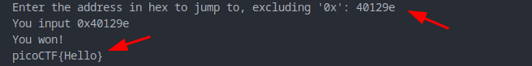

Sol:

look the source code carefull.

we have to call this `win` function to get the `flag` but after running the `binary` we see, it asks for corresponding address to call, so we need address of `win` function to call it. before that create  test flag in `flag.txt`

we opened the binary in `binaryninja` to get the `win` function's `address`

then run the binary and paste the corresponding address

run the `nc` command and get the actual `flag`

