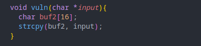
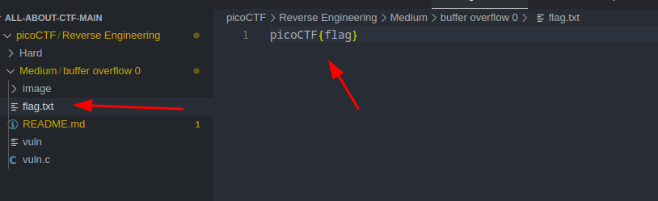
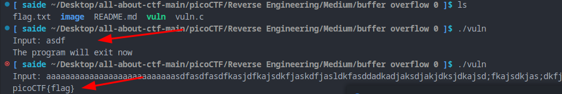
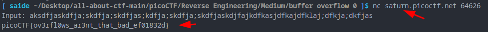

Sol:

this part is vulnerable

if you give more than 16 bytes as input it will buffer overflow

let's check, create a `flag` file in the same directory

now run the `vuln` binary

it revealed the `flag`

so

