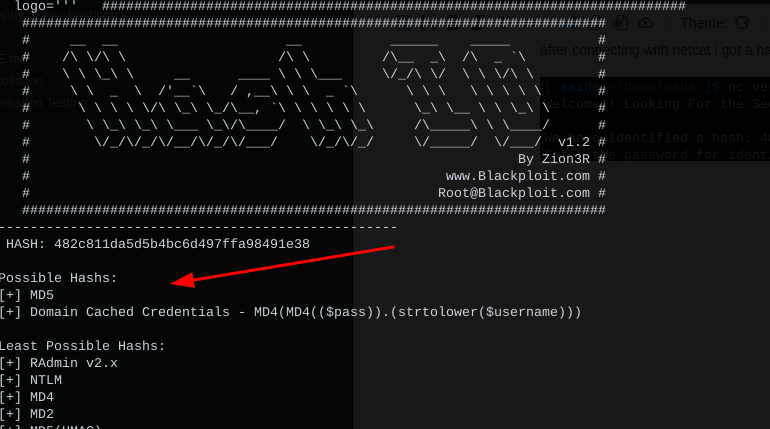
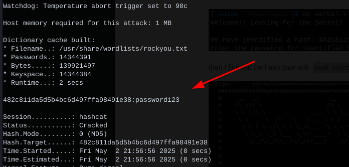
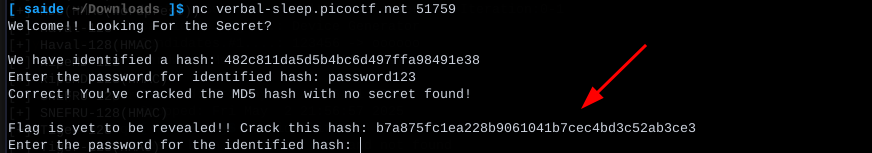
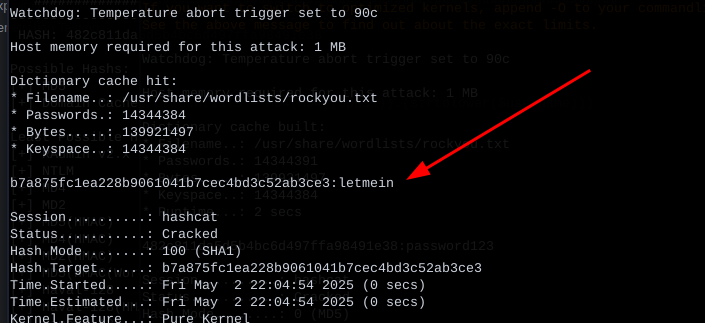
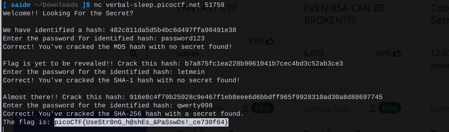

after connecting with netcat i got a hash

then I find out the hash type with `hash-identifier`

then I cracked the hash with `hashcat` with `rockyou.txt` file

after puting the password, it gave me another hash

then I repeat the same task, at first I identified the hash type then crack it.

after cracking 3 hash, finally I got the flag

