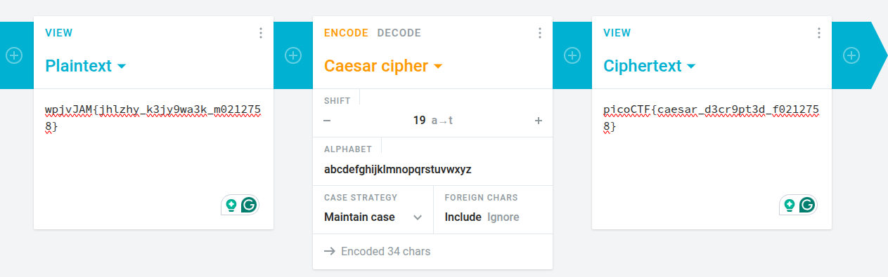

#### Sol

`YidkM0JxZGtwQlRYdHFhR3g2YUhsZmF6TnFlVGwzWVROclgyMHdNakV5TnpVNGZRPT0nCg==`

decode with `base64`

`b'd3BqdkpBTXtqaGx6aHlfazNqeTl3YTNrX20wMjEyNzU4fQ=='`

then decode `base64` again `d3BqdkpBTXtqaGx6aHlfazNqeTl3YTNrX20wMjEyNzU4fQ==` this part

and

`wpjvJAM{jhlzhy_k3jy9wa3k_m0212758}`

then do caeser cipher decod with 19 right shift

