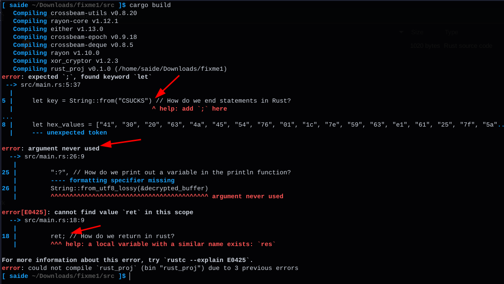
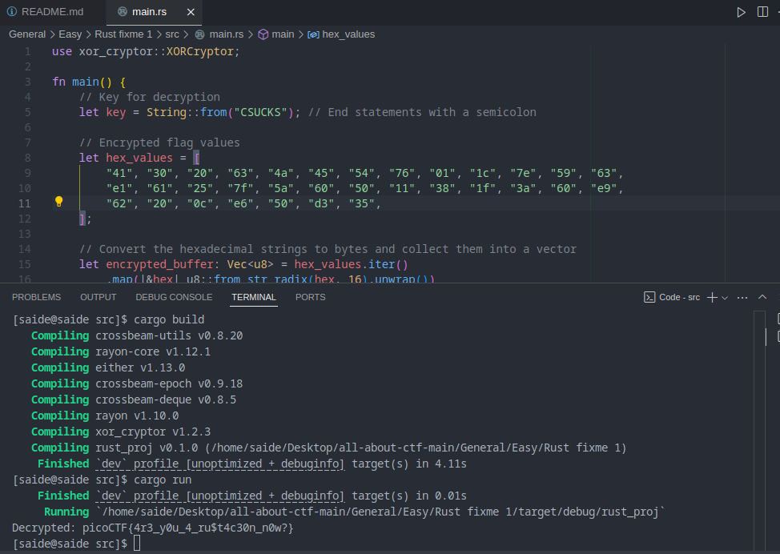

Try to build the program, you will notice the bugs and try to fix those

# Rust XOR Decryptor

## Overview

This project is a simple Rust application that decrypts a series of hexadecimal values using an XOR cipher. It utilizes the `xor_cryptor` crate for decryption.

## Bugs and Fixes

### 1. Missing Semicolon

- **Bug**: The statement initializing the decryption key was missing a semicolon at the end.
- **Fix**: Added a semicolon to properly terminate the statement.

### 2. Incorrect Print Statement

- **Bug**: The `println!` macro had an incorrect format string, which led to an error about an unused argument.
- **Fix**: Updated the format string to include a valid placeholder (`{}`) for printing the decrypted value.

### 3. Incorrect Return Statement

- **Bug**: An invalid keyword `ret` was used instead of the correct `return` keyword to exit the function.
- **Fix**: Changed `ret;` to `return;` to properly terminate the function when an error occurs.

### 4. Missing Crate Import

- **Bug**: The `xor_cryptor` crate was not linked in the project, leading to an unresolved import error.
- **Fix**: Added the `xor_cryptor` dependency in the `Cargo.toml` file.
