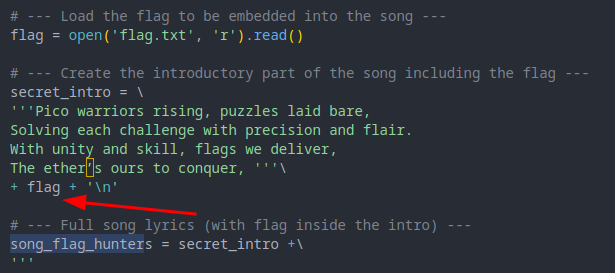
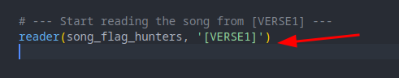
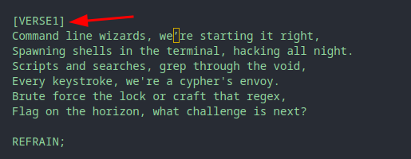
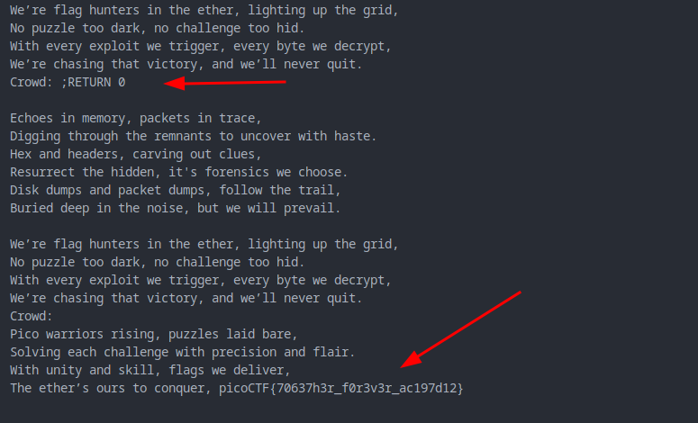

Author: syreal

#### Description

**Lyrics jump from verses to the refrain kind of like a subroutine call. There's a hidden refrain this program doesn't print by default. Can you get it to print it? There might be something in it for you.**The program's source code can be downloaded [here](https://challenge-files.picoctf.net/c_verbal_sleep/064d0eba10978d362ad2517e0e6c7d68185078e0b2fca217f8bce134d3180cfc/lyric-reader.py).

**Connect to the program with netcat:**`$ nc verbal-sleep.picoctf.net 51134`

### Solution

#### Look carefully:

```python
elif re.match(r"RETURN [0-9]+", line):
    lip = int(line.split()[1])  # Jump to this line
```

it's a jumper.

our flag is insidethe **secret intro**



but the script starts reading with **verse 1** which skips the flag





so we have to read the **secret intro** by triggering the **RETURN VALUE**

* When you insert `;RETURN 0`, it triggers the `RETURN` handler.
* `lip = 0`, meaning the lyric reader  **jumps back to the first line of the song** .
* Since the flag is embedded there (in the `secret_intro` part), it starts printing the  **intro lines with the flag** !

---

### Visual Layout (Simplified):

| Line # | Content                   |
| :----: | :------------------------ |
|   0   | Flag intro (flag is here) |
|   1   | (empty)                   |
|   2   | `[REFRAIN]`             |
|   3+   | Rest of the song          |

---

### So in short:

* `;RETURN 0` **rewinds the song** to line 0,
* **line 0 contains the flag** ,
* **thus you reveal and reprint the flag!**

---


