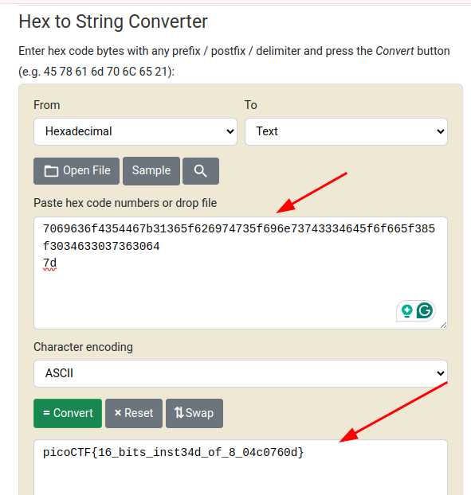

# Description

I wonder what this really is... [enc](https://mercury.picoctf.net/static/2b4cea9b07db22bf4f933fddd1b8caa9/enc) `''.join([chr((ord(flag[i]) << 8) + ord(flag[i + 1])) for i in range(0, len(flag), 2)])`

## Explanation

```python
''.join([chr((ord(flag[i]) << 8) + ord(flag[i + 1])) for i in range(0, len(flag), 2)])
```

### Purpose:

This line **converts pairs of characters** from the string `flag` into  **a sequence of Unicode characters** , where each new character is created by combining two bytes (the original two characters) into a  **single 16-bit number** .

---

### Step-by-Step Breakdown:

#### 1. `for i in range(0, len(flag), 2)`

This loops over the string `flag` in  **steps of 2** , so it takes characters in  **pairs** : `flag[0] & flag[1]`, then `flag[2] & flag[3]`, and so on.

#### 2. `ord(flag[i])`

`ord()` converts a character into its  **ASCII (or Unicode) integer value** . For example, `ord('A')` gives `65`.

#### 3. `(ord(flag[i]) << 8)`

This  **shifts the first character's value 8 bits to the left** , effectively making it the high byte of a 16-bit value. For example, if `ord(flag[i])` is `65`, then `65 << 8` is `16640`.

#### 4. `+ ord(flag[i + 1])`

This adds the **next character's ASCII value** as the low byte. So now you have a full 16-bit number formed from two characters.

#### 5. `chr(...)`

Converts this combined number into a  **Unicode character** .

#### 6. `''.join([...])`

Joins all those Unicode characters together into a new string.

---

### Example:

```python
flag = "ABCD"
```

* Pairs: ("A", "B") and ("C", "D")
* ord('A') = 65, ord('B') = 66 → (65 << 8) + 66 = 16706 → chr(16706)
* ord('C') = 67, ord('D') = 68 → (67 << 8) + 68 = 17220 → chr(17220)

So you get something like:

```python
chr(16706) + chr(17220)
```

Which is a  **2-character Unicode string** , made by encoding each 2-char pair into a single 16-bit char.

---


## Solution

python
Python 3.13.2 (main, Feb  5 2025, 08:05:21) [GCC 14.2.1 20250128] on linux
Type "help", "copyright", "credits" or "license" for more information.

```
python terminal
>>
>> enc=open("enc").read()
>> print(enc)
>> 灩捯䍔䙻ㄶ形楴獟楮獴㌴摟潦弸弰㑣〷㘰摽
>> print(hex(ord(enc[0])))
>> 0x7069
>> for c in enc:
>> ...     print(hex(ord(c)).lstrip("0x"),end='')
>> ...
>> 7069636f4354467b31365f626974735f696e73743334645f6f665f385f30346330373630647d
>>
```



