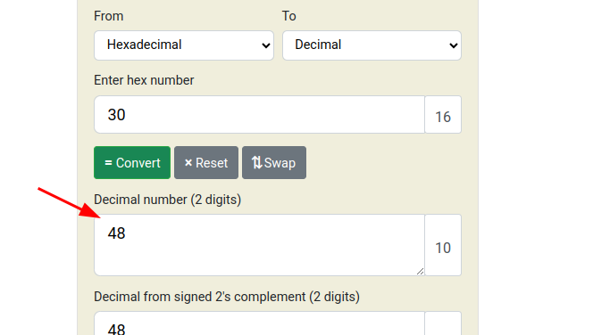

#### Description

**Can you figure out what is in the** `eax` **register? Put your answer in the picoCTF flag format:** `picoCTF{n}` **where** `n` **is the contents of the** `eax` **register in the decimal number base. If the answer was** `0x11` **your flag would be** `picoCTF{17}`.**Download the assembly dump** [here](https://artifacts.picoctf.net/c/509/disassembler-dump0_a.txt).

#### Solution:

Check the **eax** registers hex's corresponding decimal value

