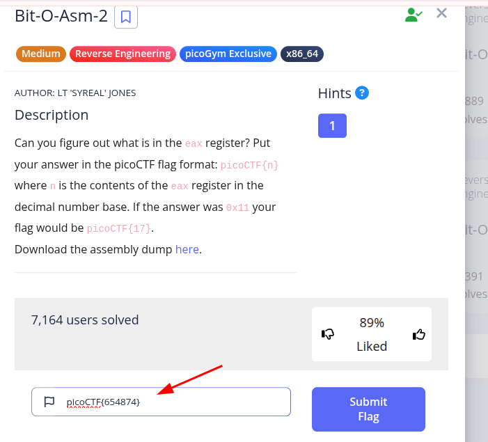

#### Description

**Can you figure out what is in the** `eax` **register? Put your answer in the picoCTF flag format:** `picoCTF{n}` **where** `n` **is the contents of the** `eax` **register in the decimal number base. If the answer was** `0x11` **your flag would be** `picoCTF{17}`.**Download the assembly dump** [here](https://artifacts.picoctf.net/c/510/disassembler-dump0_b.txt).

#### Sol:

Check these two lines:

```
<+15>:    mov    DWORD PTR [rbp-0x4],0x9fe1a
<+22>:    mov    eax,DWORD PTR [rbp-0x4]
```

`0x9fe1a` was moved to `[rbp-0x4]` corresponding decimal value `654874`

then, `654874` was moved to `eax` with address `[rbp-0x4]`

so, finally, `eax` contain `654874`



