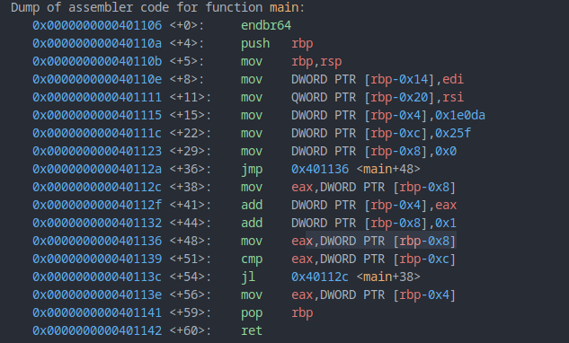
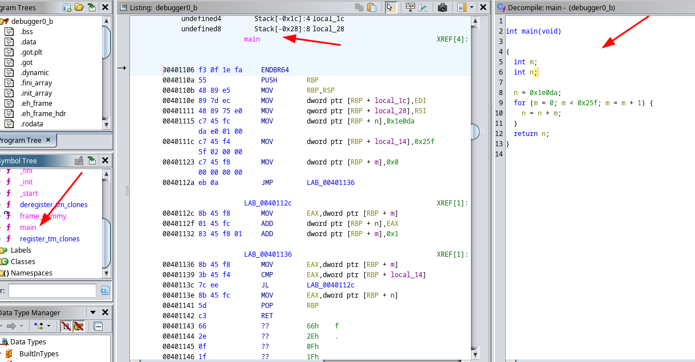
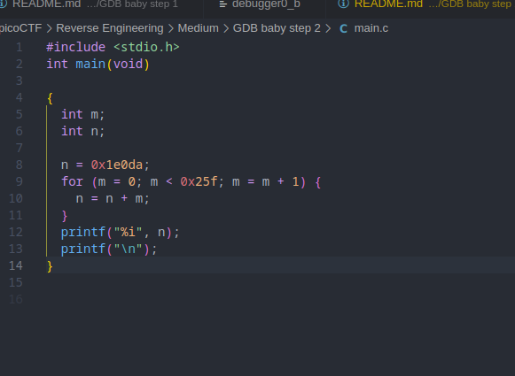
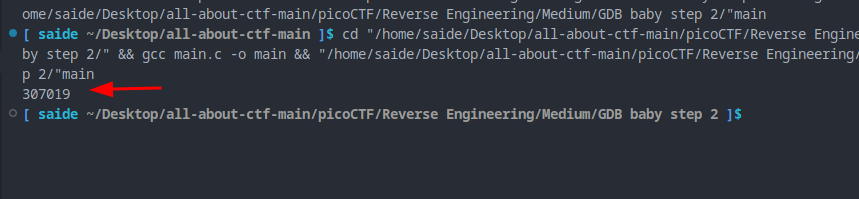

#### Follow this steps

1. Download the binary
2. give executable permission
3. open in gdb
4. disassemble main
5. observe the registers value

Let's analyse the assembly code

   0x000000000040110e <+8>:     mov    DWORD PTR [rbp-0x14],edi
   0x0000000000401111 <+11>:    mov    QWORD PTR [rbp-0x20],rsi
   0x0000000000401115 <+15>:    mov    DWORD PTR [rbp-0x4],0x1e0da
   0x000000000040111c <+22>:    mov    DWORD PTR [rbp-0xc],0x25f
   0x0000000000401123 <+29>:    mov    DWORD PTR [rbp-0x8],0x0

   0x000000000040112a <+36>:    jmp    0x401136 <main+48>

   0x000000000040112c <+38>:    mov    eax,DWORD PTR [rbp-0x8]
   0x000000000040112f <+41>:    add    DWORD PTR [rbp-0x4],eax
   0x0000000000401132 <+44>:    add    DWORD PTR [rbp-0x8],0x1
   0x0000000000401136 <+48>:    mov    eax,DWORD PTR [rbp-0x8]

   0x0000000000401139 <+51>:    cmp    eax,DWORD PTR [rbp-0xc]
   0x000000000040113c <+54>:    jl     0x40112c <main+38>

   0x000000000040113e <+56>:    mov    eax,DWORD PTR [rbp-0x4]

it follows a loop untill it reaches to 0x25f in decimal 607

manually it will too much time.

let's automate this,

 you can get the main code from **ghidra** 

from the code we construct the **main.c** 

so the flag is **picoCTF{307019}**
