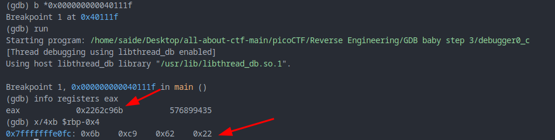

#### Description

**Now for something a little different.** `0x2262c96b` **is loaded into memory in the** `main` **function. Examine byte-wise the memory that the constant is loaded in by using the GDB command** `x/4xb addr`. The flag is the four bytes as they are stored in memory. If you find the bytes `0x11 0x22 0x33 0x44` **in the memory location, your flag would be:** `picoCTF{0x11223344}`.**Debug** [this](https://artifacts.picoctf.net/c/531/debugger0_c).

#### Sol:

```
0x0000000000401106 <+0>:     endbr64
   0x000000000040110a <+4>:     push   rbp
   0x000000000040110b <+5>:     mov    rbp,rsp
   0x000000000040110e <+8>:     mov    DWORD PTR [rbp-0x14],edi
   0x0000000000401111 <+11>:    mov    QWORD PTR [rbp-0x20],rsi
   0x0000000000401115 <+15>:    mov    DWORD PTR [rbp-0x4],0x2262c96b
   0x000000000040111c <+22>:    mov    eax,DWORD PTR [rbp-0x4]
   0x000000000040111f <+25>:    pop    rbp
   0x0000000000401120 <+26>:    ret
```

look at this` <+15>:    mov    DWORD PTR [rbp-0x4],0x2262c96b`

this `0x2262c96b` value is loading to `[rbp-0x4]` then the value of `[rbp-0x4]` is loading to `eax` register.

now, let's set a `break` point on `<+25>`  and run, then check the `eax` register, it will show `little endian` value (from least to most significant bit), or inspect the pointer `rbp-0x4`





so the flag is `picoCTF{6bc96222}`
