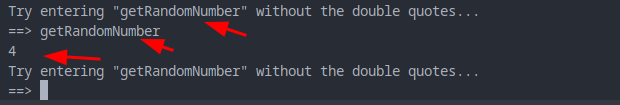
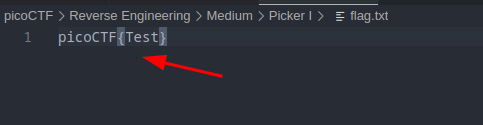
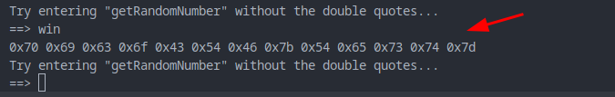
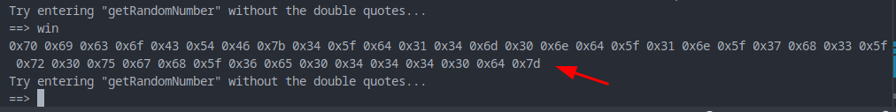
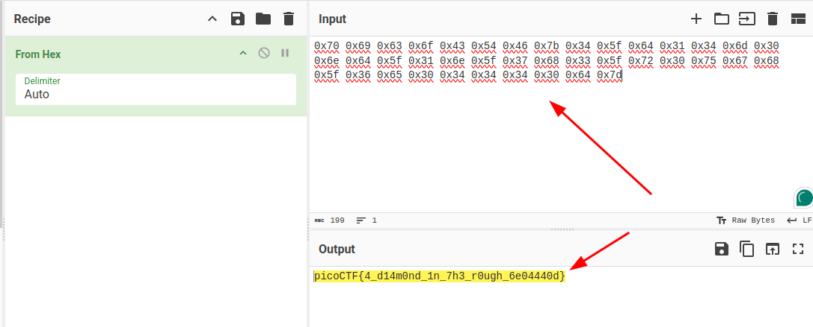

#### Description

**This service can provide you with a random number, but can it do anything else?** 

Connect to the program with netcat:

`$ nc saturn.picoctf.net 54864`

The program's source code can be downloaded [here](https://artifacts.picoctf.net/c/514/picker-I.py).

#### Solution

Source code is vulnerable.

functions are

```
getRandomNumber
exit
esoteric1
esoteric2
win
```

it's calling the function directly with corresponding name as input we provide



I tried to call **win**


Let's create a **flag.txt** file and check again



Let's check

Got our flag's corresponding hex



Now, let's get the final flag from **netcat**




