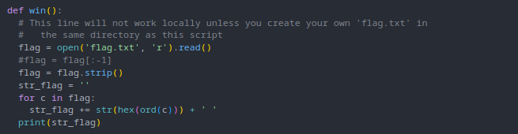
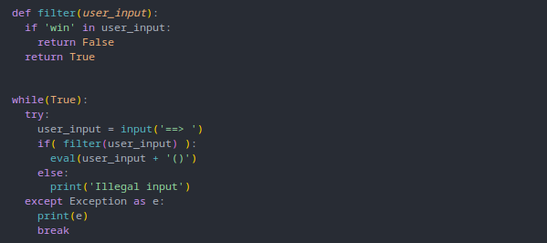
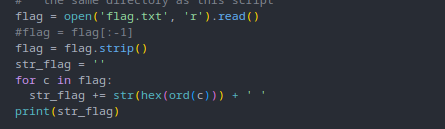
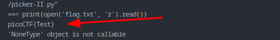
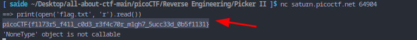

Sol:

to get the flag we have to call this function

but if we try to call it, it will get filtered

but there is a gap, it `eval` means execute the user input except the `win` key word, so why no, we open the flag directly and read that with this

Let's test it

it worked. so let's get the original flag

