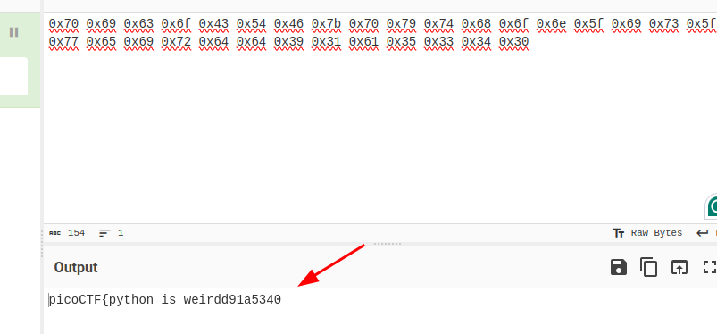

#### Description

**We invented a new cypher that uses "quantum entanglement" to encode the flag. Do you have what it takes to decode it?**Connect to the program with netcat:`$ nc verbal-sleep.picoctf.net 61849`The program's source code can be downloaded [here](https://challenge-files.picoctf.net/c_verbal_sleep/90141f0e9372fecd46d0143f5be59d7d3369394eae1c41cb733a254a5a3201b9/quantum_scrambler.py).

#### Solution:

we got a long srings from **nc**

then we got from cyberchef

Let's test:

#### Observerb the pattern 

**Let's build a python script to automate this**

Flag hex value:

Got the flag:

