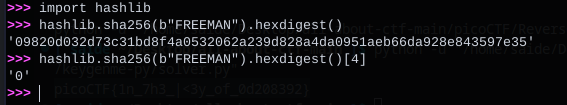
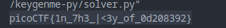

#### Description

[keygenme-trial.py](https://mercury.picoctf.net/static/fb75b48f9214cf992a2199b5785564e7/keygenme-trial.py)

#### Sol:

It's a calculator trial version checker full code.

Suppose, your user name is `FREEMAN`, then it wil convert it into hash with `hashlib.sha256(b"FREEMAN").hexdigest()`

then it will check specific position to match their key with 

```
# Check dynamic part --v
        if key[i] != hashlib.sha256(username_trial).hexdigest()[4]:
            return False
        else:
            i += 1

        if key[i] != hashlib.sha256(username_trial).hexdigest()[5]:
            return False
        else:
            i += 1

        if key[i] != hashlib.sha256(username_trial).hexdigest()[3]:
            return False
        else:
            i += 1

        if key[i] != hashlib.sha256(username_trial).hexdigest()[6]:
            return False
        else:
            i += 1

        if key[i] != hashlib.sha256(username_trial).hexdigest()[2]:
            return False
        else:
            i += 1

        if key[i] != hashlib.sha256(username_trial).hexdigest()[7]:
            return False
        else:
            i += 1

        if key[i] != hashlib.sha256(username_trial).hexdigest()[1]:
            return False
        else:
            i += 1

        if key[i] != hashlib.sha256(username_trial).hexdigest()[8]:
            return False

```


the dynamic part is the key part of their licence, but here the dynamic part is a part of our flag.

let's calculate one position with python



it worked. but to automate this task let's build a `solver.py `script.

```
import hashlib
key_part_static1_trial = "picoCTF{1n_7h3_|<3y_of_"
key_part_static2_trial = "}"
temp = hashlib.sha256(b"FREEMAN").hexdigest()
key_part_dynamic1_trial = temp[4] + temp[5] + temp[3] + temp[6] + temp[2] + temp[7] + temp[1] + temp[8]
key_full_template_trial = key_part_static1_trial + key_part_dynamic1_trial + key_part_static2_trial
print(key_full_template_trial)
```

We got the flag


