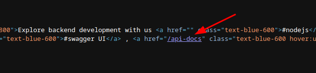

found this `api-docs` link in source code

after visiting the docs I got this

then I ran `http://verbal-sleep.picoctf.net:63025/heapdump` it started to download the `heapdump` file. Then I grep the flag from that file

